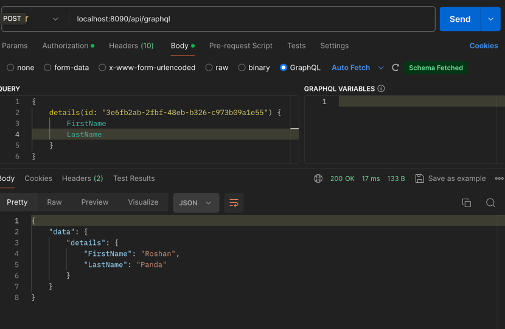

# SubscriptionModel
A simple Demonstration using Scala and ZIO

### SignUp
signup valid request : 

```
{
"FirstName": "Roshan",
"LastName": "Panda",
"UserName": "RP",
"PassWord": "Roshan@2021",
"age": 30
}
```
Response:
```
{
    "id": "888d7bee-59c9-475a-ac04-2f7af98812cf",
    "message": "welcome to the family",
    "success": true
}
```
Error Response:
```
{
    "error": "Not a valid password",
    "success": false
}
```
Graphql query:

```agsl
{
    details(id: "3e6fb2ab-2fbf-48eb-b326-c973b09a1e55") {
        FirstName
        LastName
    }
}
```



